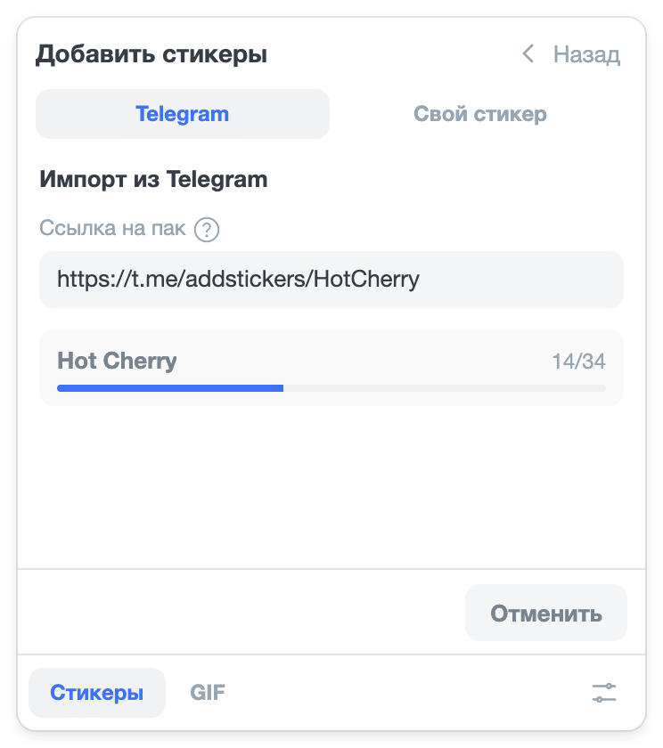

# Импорт из Telegram

Пак стикеров из Telegram можно добавить в amo stickers целиком: стикеры станут GIF и появятся в ленте отдельным
разделом. Конвертируются статичные, анимированные (`.tgs`) и видеостикеры.

Настраивать для импорта ничего не нужно: amo stickers скачивает пак через Telegram Bot API встроенным ботом. Свой
бот нужен, только если встроенный недоступен, — об этом скажет ошибка при импорте (раздел [«Свой бот»](#own-bot)).

## 1. Скопируйте ссылку на пак {#pack-link}

**Нажмите на стикер из пака в чате Telegram, в окне пака откройте меню «⋮» и выберите «Копировать ссылку».**

Путь одинаковый в приложении Telegram на компьютере, в веб-версии и на телефоне; в некоторых приложениях меню
обозначено «…», а не «⋮». В Telegram для macOS пункта «Копировать ссылку» в меню нет: выберите «Поделиться»
и в окне выбора чата нажмите кнопку копирования ссылки справа вверху. Ссылку на пак, который у вас уже добавлен, можно скопировать и из настроек: «Настройки» →
«Стикеры и эмодзи» → нажмите на пак → меню «⋮» → «Копировать ссылку».

Ссылка выглядит так: `https://t.me/addstickers/Имя`. Подойдёт и ссылка на пак эмодзи (`t.me/addemoji/Имя`) или одно
имя пака — часть ссылки после последней `/`.

## 2. Импортируйте пак {#import}

1. В amo stickers откройте режим «Стикеры» и нажмите «+» справа от вкладок разделов — откроется экран «Добавить
   стикеры».
2. В разделе «Импорт из Telegram» вставьте ссылку в поле и нажмите «Импорт».
3. Дождитесь конца импорта: внизу панели идёт счёт стикеров, например «„Имя пака“: 12/40», а в конце — «Пак „Имя пака“
   добавлен». Пока идёт импорт, панель не закрывается, если увести с неё курсор.

Пак появится отдельной вкладкой в режиме «Стикеры». Стикеры каждого пака конвертируются один раз при импорте — дальше
они отправляются сразу.

## Если не получилось

- **«Встроенный бот Telegram недоступен. Укажите свой токен бота в настройках»** — Telegram отказал встроенному боту:
  тот упёрся в лимит запросов или его токен отозван. Повторите импорт позже или заведите [свой бот](#own-bot).
- **«Укажите токен бота в настройках»** — в вашей сборке amo stickers нет встроенного бота, например она собрана из
  исходников. Заведите [свой бот](#own-bot).
- **«Не понял ссылку. Нужна вида t.me/addstickers/Name»** — в поле не ссылка на пак. Скопируйте её заново по
  [шагу 1](#pack-link).
- **«HTTP 401 … Unauthorized»** — Telegram не принял ваш токен. Проверьте, что токен скопирован целиком, или получите
  его заново по шагу [«Скопируйте токен»](#own-bot-token) и вставьте в «Настройки».
- **«HTTP 400 … STICKERSET_INVALID»** — Telegram не нашёл пак. Проверьте, что пак открывается по ссылке в самом
  Telegram, и скопируйте ссылку заново по [шагу 1](#pack-link).

## Свой бот (необязательно) {#own-bot}

Свой бот нужен, если при импорте появляется ошибка «Встроенный бот Telegram недоступен». С токеном своего бота
amo stickers импортирует паки через него, а не через встроенного. Бота достаточно создать один раз — добавлять его
в чаты и что-то в нём настраивать не нужно.

::: warning Токен — секрет
Токен бота даёт полное управление ботом: с ним кто угодно сможет писать от имени бота и менять его. Не пересылайте
токен в чатах и не показывайте на скриншотах.

amo stickers хранит токен только в вашем браузере и отправляет его только в Telegram (`api.telegram.org`). Если токен
всё же попал к кому-то, выпустите новый: откройте бота в @BotFather, нажмите «Revoke» и вставьте новый токен в «Настройки»
вместо старого.
:::

### 1. Создайте бота

1. Откройте в Telegram [@BotFather](https://t.me/BotFather) — официальный бот Telegram для создания ботов — и нажмите
   «Open» у кнопки внизу чата: откроется окно @BotFather со списком ваших ботов.
2. В разделе «My bots» нажмите «Create a New Bot».

3. Введите имя бота — любое, например `amo stickers`: бот нужен только для импорта. Описание («About») можно
   не заполнять.
4. Введите имя пользователя бота — латиницей, цифрами или `_`, оно должно заканчиваться на `bot`, например
   `ivan_amo_stickers_bot`. Под полем @BotFather сразу покажет, свободно ли имя.
5. Нажмите «Create Bot».

В старом интерфейсе Telegram окна нет: там бот создаётся командой `/newbot` в чате с @BotFather, и имя и имя
пользователя он спросит сообщениями.

### 2. Скопируйте токен {#own-bot-token}

После создания откроется страница бота с токеном — строкой вида `1234567890:AAH…`. Нажмите «Copy»: токен скопируется
целиком.

Токен можно скопировать заново в любой момент: откройте @BotFather, выберите бота в «My bots» и нажмите «Copy».

### 3. Вставьте токен в «Настройки»

1. Откройте amo и наведите курсор на кнопку стикеров в строке ввода или нажмите на неё.
2. Внизу панели нажмите «Настройки».
3. Вставьте токен в поле «Свой токен Telegram-бота (необязательно)» и нажмите «Сохранить». Внизу панели появится
   «Сохранено».

<!-- скрин: img/setup/settings-token.png — поле «Свой токен Telegram-бота (необязательно)» и его подсказка -->

Повторите импорт по шагу [«Импортируйте пак»](#import): со своим токеном он идёт через вашего бота, а не через
встроенного.

Другие вопросы — в разделе [«Частые вопросы»](../faq).
